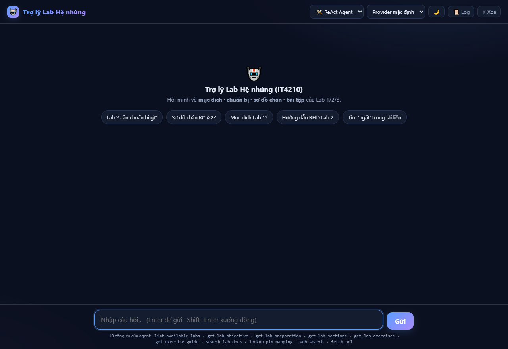
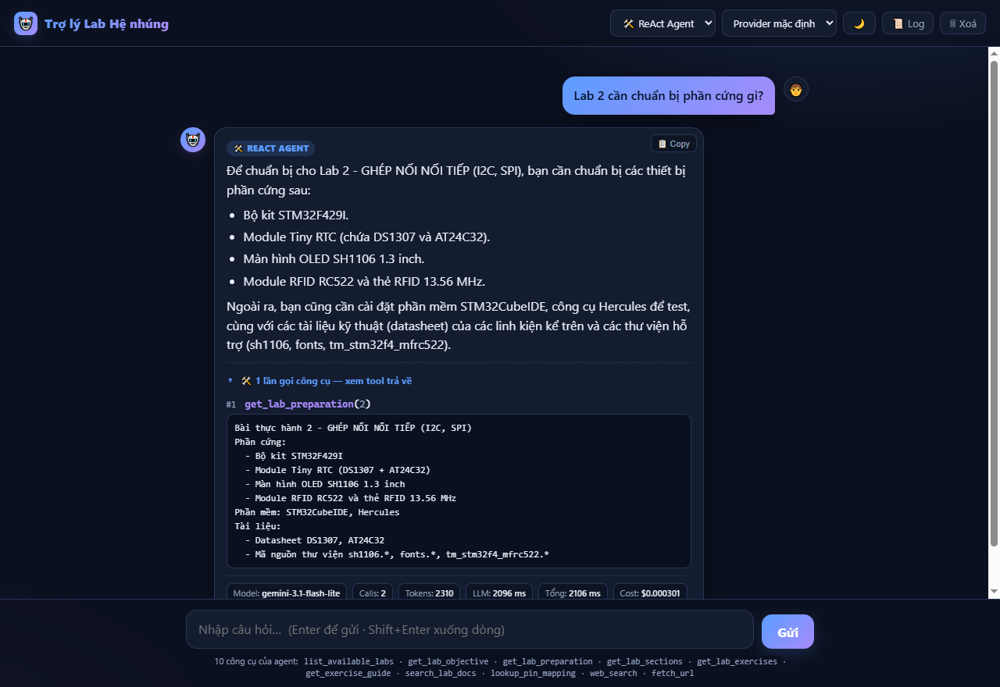
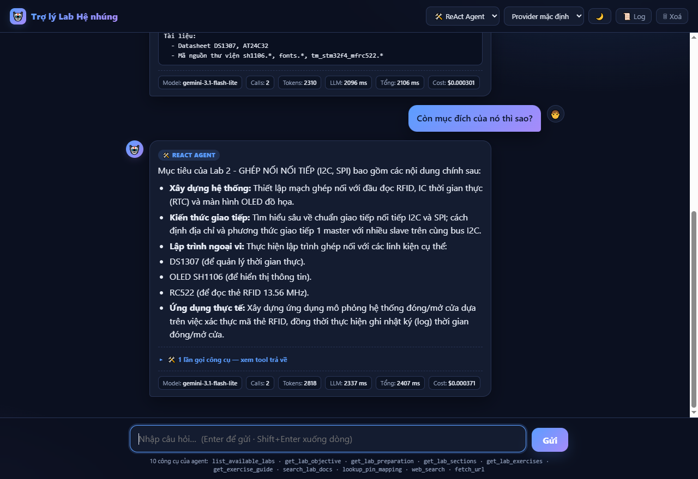
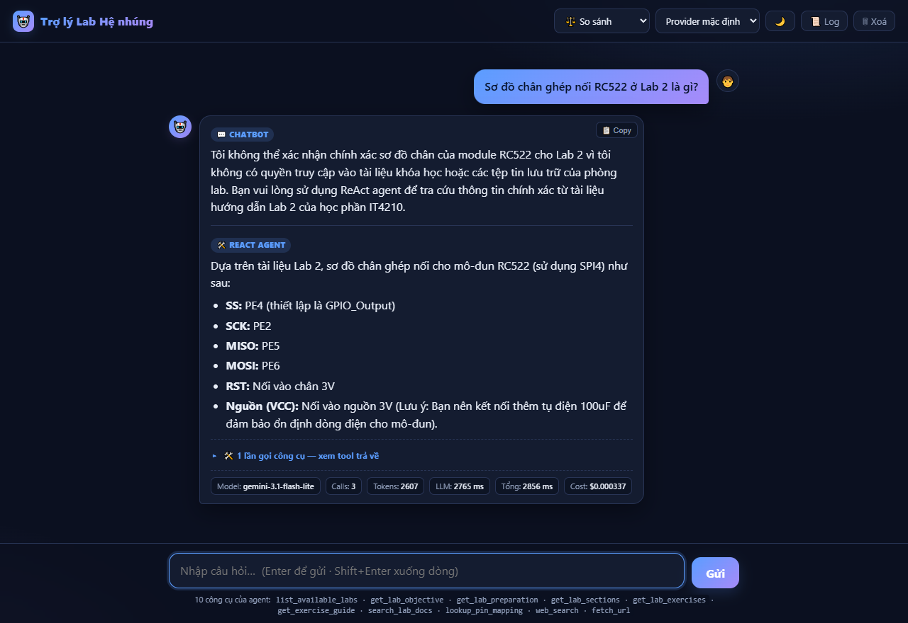
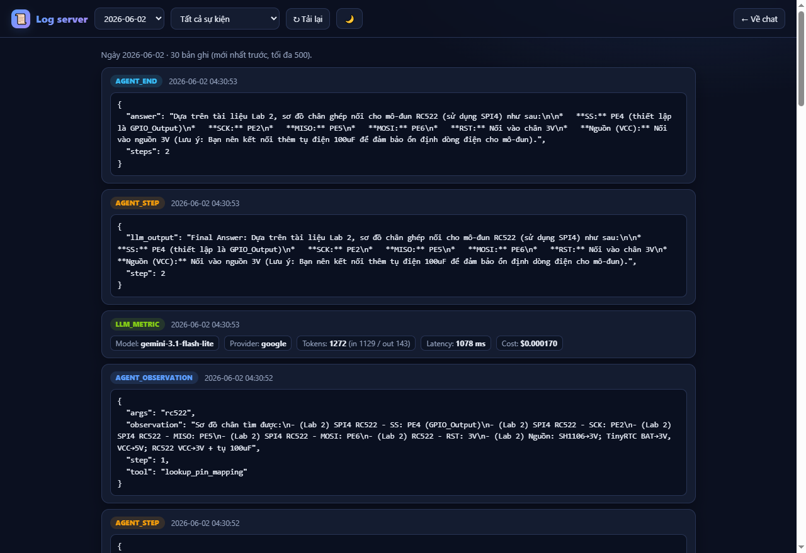

# 🤖 Trợ lý Lab Hệ nhúng (IT4210)

> Trợ lý AI hỏi–đáp cho môn **Hệ thống nhúng (IT4210)** — trả lời về **mục đích lab,
> chuẩn bị phần cứng/phần mềm, sơ đồ chân và hướng dẫn bài tập** của Lab 1/2/3,
> dựa trên tài liệu thật của môn học (không bịa).

Sản phẩm gồm một **giao diện web chat** và một **CLI**, chạy trên 3 nhà cung cấp LLM
(**OpenAI · Google Gemini · model local Phi-3**) và đóng gói sẵn bằng **Docker**.
Điểm cốt lõi: so sánh **Chatbot thường** (chỉ dựa kiến thức model) với **ReAct Agent**
(có công cụ tra cứu, trả lời *grounded* theo tài liệu).



---

## ✨ Tính năng chính

- 💬 **Hội thoại đa lượt** — nhớ ngữ cảnh theo phiên, hỏi nối tiếp tự nhiên
  ("còn *nó* cần gì?", "*bài đó* có mấy bài tập?") mà không phải nhắc lại số lab.
- 🛠️ **ReAct Agent với 10 công cụ** tra cứu knowledge base + web (datasheet, chuẩn giao tiếp).
- ⚖️ **3 chế độ**: ReAct Agent · Chatbot baseline · So sánh song song trên cùng câu hỏi.
- 🔌 **Đa nhà cung cấp**: OpenAI, Google Gemini, hoặc Phi-3 chạy offline trên CPU.
  Đổi provider/model ngay trên giao diện hoặc qua `.env`.
- 📊 **Telemetry** mỗi câu trả lời: số token, độ trễ, chi phí ước tính; log JSON xem tại `/logs`.
- 🌗 **Giao diện** sáng/tối, streaming từng bước gọi tool (SSE), responsive, an toàn XSS.
- 🐳 **Docker hoá** sẵn (Dockerfile + Compose) — chạy bằng một lệnh.
- 🛡️ **Production-minded**: chống prompt-injection, giới hạn input, retry + backoff,
  loop-guard, timeout cho từng lượt LLM.

---

## 📸 Giao diện & chức năng

### 🛠️ ReAct Agent — trả lời *grounded* kèm bước gọi công cụ
Agent gọi đúng tool (`get_lab_preparation`), hiện **Observation** tool trả về và
**telemetry** (model, số token, độ trễ, chi phí) ngay dưới mỗi câu trả lời.



### 💬 Hội thoại đa lượt — nhớ ngữ cảnh
Hỏi nối tiếp *"Còn mục đích của **nó** thì sao?"* — trợ lý tự hiểu "nó" là Lab 2
(từ câu trước) và gọi `get_lab_objective(2)`, không cần nhắc lại số lab.



### ⚖️ So sánh Chatbot vs ReAct Agent
Cùng câu hỏi "sơ đồ chân RC522": **Chatbot** thừa nhận không chắc, **Agent** tra cứu
tài liệu và đưa ra chân chính xác (SS=PE4, SCK=PE2, MISO=PE5, MOSI=PE6…).



### 📜 Trang Log — telemetry & vết chạy của agent
Xem lại theo ngày: từng bước `Thought/Action/Observation`, token/chi phí/độ trễ mỗi
lần gọi LLM, lọc theo loại sự kiện.



---

## 🚀 Bắt đầu nhanh

### Cách 1 — Docker (khuyến nghị)

```bash
# 1. Khai báo khoá API (sao chép mẫu rồi điền)
cp .env.example .env        # rồi sửa OPENAI_API_KEY / GEMINI_API_KEY

# 2. Build & chạy
docker compose up --build
```
Mở **http://localhost:5000**. Khoá API được nạp lúc chạy từ `.env` (không nướng vào image).

> Image web gồm provider **OpenAI + Google**. Provider **local (Phi-3)** cần model 2.4 GB
> nên không nằm trong image — dùng Cách 2 nếu muốn chạy offline.

### Cách 2 — Python trực tiếp

```bash
pip install -r requirements.txt
cp .env.example .env         # điền khoá API (hoặc dùng provider local)

python -m webapp.app          # web tại http://127.0.0.1:5000
#   python -m webapp.app --port 8000 --provider openai
```

---

## ⚙️ Cấu hình (`.env`)

| Biến | Ý nghĩa | Mặc định |
| :--- | :--- | :--- |
| `DEFAULT_PROVIDER` | `openai` \| `google` \| `local` | `google` |
| `OPENAI_API_KEY` | Khoá OpenAI | — |
| `OPENAI_MODEL` | Model khi dùng OpenAI | `gpt-4o` |
| `GEMINI_API_KEY` | Khoá Google Gemini | — |
| `GEMINI_MODEL` | Model khi dùng Gemini | `gemini-3.1-flash-lite` |
| `LOCAL_MODEL_PATH` | Đường dẫn file `.gguf` (provider local) | `./Phi-3-mini-4k-instruct-q4.gguf` |
| `LOCAL_GPU_LAYERS` | Số layer offload GPU (0 = chỉ CPU) | `0` |
| `LOCAL_MAX_TOKENS` | Token tối đa/câu (yếu tố chính quyết định độ trễ trên CPU) | `256` |
| `LOG_LEVEL` | Mức log | `INFO` |

Mỗi provider có **model riêng** (`OPENAI_MODEL`, `GEMINI_MODEL`) nên đổi `DEFAULT_PROVIDER`
không phải sửa lại model. (`DEFAULT_MODEL` cũ vẫn được hỗ trợ làm fallback.)

### Chạy với model local (Phi-3, offline trên CPU)

Không cần khoá API — model **Phi-3-mini-4k-instruct** (lượng tử hoá Q4, ~2.2 GB)
chạy thẳng trên CPU qua `llama-cpp-python`.

#### Bước 1 — Tải model `.gguf`

- **Trang model:** <https://huggingface.co/microsoft/Phi-3-mini-4k-instruct-gguf>
- **Link tải trực tiếp:**
  <https://huggingface.co/microsoft/Phi-3-mini-4k-instruct-gguf/resolve/main/Phi-3-mini-4k-instruct-q4.gguf>

Chọn **một** cách tải:

```powershell
# Windows (PowerShell) — tải về đúng thư mục gốc repo
Invoke-WebRequest `
  "https://huggingface.co/microsoft/Phi-3-mini-4k-instruct-gguf/resolve/main/Phi-3-mini-4k-instruct-q4.gguf" `
  -OutFile ".\Phi-3-mini-4k-instruct-q4.gguf"
```

```bash
# Linux / macOS — curl (hoặc thay bằng wget -O ...)
curl -L -o Phi-3-mini-4k-instruct-q4.gguf \
  "https://huggingface.co/microsoft/Phi-3-mini-4k-instruct-gguf/resolve/main/Phi-3-mini-4k-instruct-q4.gguf"
```

```bash
# Hoặc dùng Hugging Face CLI (tải nhanh, có resume)
pip install -U "huggingface_hub[cli]"
huggingface-cli download microsoft/Phi-3-mini-4k-instruct-gguf \
  Phi-3-mini-4k-instruct-q4.gguf --local-dir .
```

#### Bước 2 — Đặt file & trỏ đường dẫn
Để file ở **thư mục gốc repo** (mặc định) hoặc trong `./models/`, rồi đặt trong `.env`:
```env
DEFAULT_PROVIDER=local
LOCAL_MODEL_PATH=./Phi-3-mini-4k-instruct-q4.gguf
LOCAL_MAX_TOKENS=256      # token/câu — yếu tố chính quyết định độ trễ trên CPU
LOCAL_GPU_LAYERS=0        # >0 hoặc -1 nếu có bản llama-cpp build GPU
```
> File `.gguf` đã nằm trong `.gitignore` (không commit binary lớn).

#### Bước 3 — Cài phụ thuộc & chạy
```bash
pip install -r requirements.txt   # gồm llama-cpp-python (build từ source nếu chưa có wheel)
python -m webapp.app              # web, provider mặc định = local
# hoặc CLI:
python main.py agent --provider local --once "Lab 1 cần chuẩn bị gì?"
```

> **Lưu ý `llama-cpp-python`:** đây là gói cần biên dịch C/C++. Nếu `pip install` báo lỗi
> build, cần có CMake + trình biên dịch (Windows: Visual Studio Build Tools hoặc MinGW-w64;
> Linux: `build-essential`; macOS: Xcode CLT). Lần nạp model đầu khá chậm — server đã
> **cache model 1 lần** để các request sau không nạp lại.
>
> Provider `local` **không** có trong image Docker (để image nhẹ). Muốn chạy local thì
> dùng Python trực tiếp như trên.

---

## 💻 Sử dụng

### Giao diện web
Trang chat (`/`): chọn **chế độ** (Agent/Chatbot/So sánh) và **provider** ở thanh trên,
gõ câu hỏi (Enter để gửi). Nút **🗑 Xoá** xoá cả hội thoại trên màn hình lẫn trí nhớ phía
server. Trang **📜 Log** (`/logs`): xem lại telemetry & các bước agent đã chạy theo ngày.

### CLI
```bash
python main.py agent --once "Lab 2 cần chuẩn bị gì và mục đích là gì?"
python main.py chatbot --once "Sơ đồ chân ghép nối RC522 là gì?"
python main.py compare "Hướng dẫn giải mã hồng ngoại NEC ở Lab 1?"
python main.py agent                      # chế độ tương tác
python main.py agent --provider openai    # ép provider
```

---

## 🧰 Công cụ của Agent (`src/tools/`)

| Tool | Chức năng |
| :--- | :--- |
| `list_available_labs` | Liệt kê các lab có trong knowledge base |
| `get_lab_objective` | Mục đích/mục tiêu của Lab 1/2/3 |
| `get_lab_preparation` | Phần cứng, phần mềm, tài liệu cần chuẩn bị |
| `get_lab_sections` | Các phần hướng dẫn chính của một lab |
| `get_lab_exercises` | Danh sách bài tập riêng của một lab |
| `get_exercise_guide` | Hướng dẫn + bài tập (lọc theo chủ đề) |
| `search_lab_docs` | Tìm kiếm toàn văn (không phân biệt dấu) |
| `lookup_pin_mapping` | Sơ đồ chân ghép nối (rc522, hs0038, led, ds1307…) |
| `web_search` · `fetch_url` | Tra cứu trên mạng (datasheet, chuẩn giao tiếp) |

Knowledge base lấy từ 3 tài liệu trong `docs/` (Lab 1: GPIO/Interrupt/Timer,
Lab 2: I2C/SPI, Lab 3: FreeRTOS/TouchGFX) → `data/embedded_labs.json`.

---

## 🏗️ Kiến trúc

```
            ┌──────────────┐      ┌──────────────────────────┐
Trình duyệt │  webapp/app  │◄────►│ Chatbot   (no tools)      │
  (chat) ──►│  Flask + SSE │      │ ReActAgent(10 tools)      │
            │  session mem │      └──────────┬───────────────┘
            └──────┬───────┘                 │
                   │                 ┌────────▼─────────┐
              /logs (JSON)           │  LLMProvider     │  OpenAI / Gemini / Local(Phi-3)
              telemetry              └────────┬─────────┘
                                     ┌────────▼─────────┐
                                     │ tools + knowledge│  data/embedded_labs.json
                                     └──────────────────┘
```

- **`LLMProvider`** (`src/core/`) — interface chung; `provider_factory` dựng provider từ `.env`.
- **`ReActAgent`** (`src/agent/`) — vòng lặp `Thought → Action → Observation → Final Answer`.
- **`Chatbot`** (`src/chatbot.py`) — baseline không tool, để đối chứng.
- **Telemetry** (`src/telemetry/`) — đếm token/chi phí/độ trễ, ghi log JSON.
- **Hội thoại** — lưu theo session (cookie) ở tầng web (engine được cache dùng chung).

---

## 🧪 Kiểm thử

```bash
python tests/test_tools.py        # công cụ + knowledge base (không cần API key)
python tests/test_agent_loop.py   # vòng lặp ReAct với mock LLM
```

---

## 📦 Tech stack

Python · Flask (SSE) · OpenAI SDK · google-generativeai · llama-cpp-python ·
pydantic · ddgs · Docker / Docker Compose.

---

## 📁 Cấu trúc thư mục

```
webapp/         # Web UI (Flask): trang chat + trang log
src/
  core/         # LLMProvider + các provider (openai/gemini/local) + factory
  agent/        # ReActAgent
  chatbot.py    # Chatbot baseline
  tools/        # 10 công cụ tra cứu lab + web
  knowledge/    # nạp & truy vấn knowledge base
  telemetry/    # logger + metrics (token/cost/latency)
data/           # embedded_labs.json (knowledge base)
docs/           # tài liệu gốc Lab 1/2/3
tests/          # unit tests
Dockerfile · docker-compose.yml · requirements*.txt
main.py         # CLI
```

---

## ⚠️ Ghi chú vận hành

- Web đang dùng **Flask development server** (đủ cho lab/demo). Triển khai thật nên đặt
  sau **gunicorn/waitress** + reverse proxy.
- Lịch sử hội thoại lưu **in-memory** theo tiến trình (mất khi restart). Cần bền vững thì
  thay bằng Redis/DB.
- Tuyệt đối **không commit `.env`** (đã nằm trong `.gitignore`).

---

*Made for HUST Embedded Systems (IT4210) — Chatbot vs ReAct Agent.*
